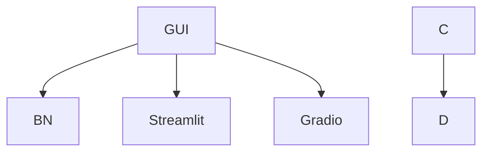

# For Test ML
test transfer


Links:
* [Nodes in markdown <Mermaid> ](https://mermaid.js.org/intro/syntax-reference.html)

## Checking version of [Mermaid](https://docs.github.com/en/get-started/writing-on-github/working-with-advanced-formatting/creating-diagrams?form=MG0AV3)
```mermaid
  info
```

## samples:


